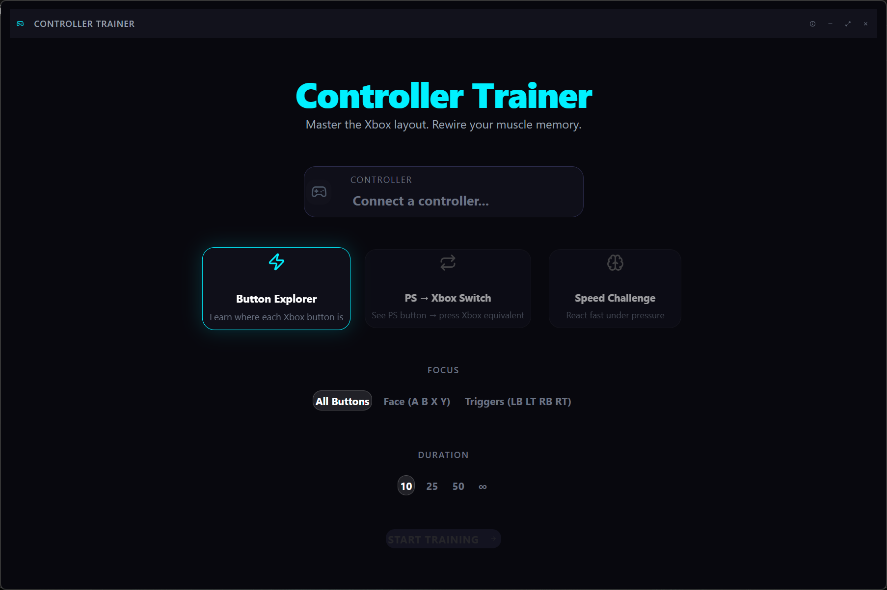

# Controller Trainer

A desktop application that trains muscle memory for Xbox controller button layouts. Designed for anyone transitioning between controller platforms (PlayStation to Xbox or vice versa).

## Features

- **Auto-detection** of any connected controller (PS, Xbox, Generic) via the Web Gamepad API
- **3 training modes**: Random, Sequential, Reverse Sequential
- **Button focus selection**: All buttons, Face buttons only, or Triggers/Bumpers only
- **Session duration**: 10, 25, 50, or unlimited presses
- **Side-by-side display**: Shows the PlayStation button alongside its Xbox equivalent with an animated arrow
- **Performance grading**: S / A / B / C / D with detailed stats
- **Dark modern UI** with smooth animations
- **Portable** — no installation required, just run the exe

## Screenshots

## Download

[Controller Trainer.exe](Controller%20Trainer.exe) — ~90 MB

## How to use

1. Download and run `Controller Trainer.exe`
2. Connect your controller to the PC
3. Select training mode, focus, and duration
4. Start training

## Requirements

- Windows 10 or 11
- Any compatible game controller (Xbox, PlayStation, or DirectInput-compatible)

